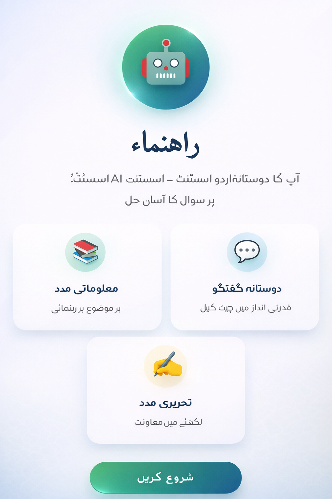
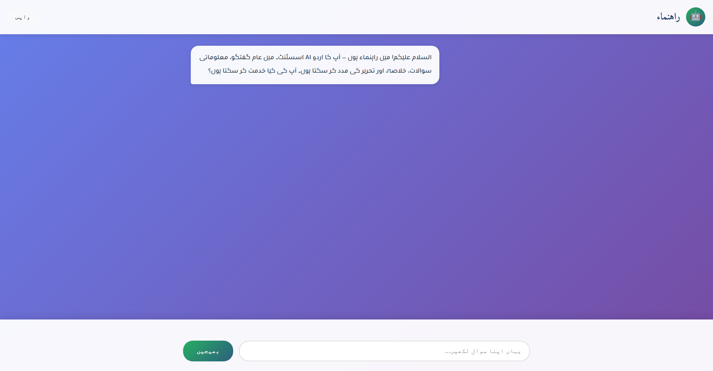
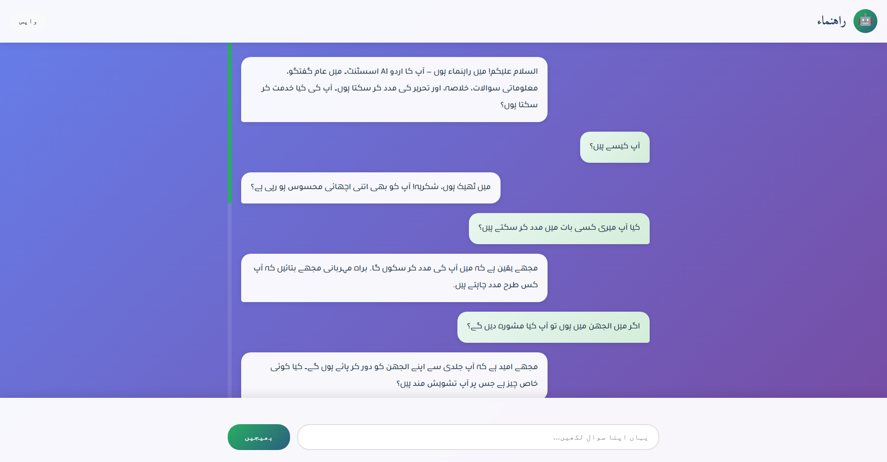

# Rahnuma (راہنماء) — Friendly Urdu AI Assistant

Rahnuma is a production-quality Urdu AI assistant designed to help users with general conversations, text rewriting, and content summarization. It is built with a focus on **Responsible AI**, incorporating multi-stage safety guardrails to ensure it does not provide medical, legal, or religious advice.



## 📺 Visual Demo

### Video Walkthrough


### UI Screenshots
| Screen 2 | Screen 3 |
| :---: | :---: |
|  |  |

## 🚀 Key Features
- **Native Urdu Fluency**: Optimized using the `Qalb-1.0-8B-Instruct` model for natural Pakistani Urdu.
- **Advanced Orchestration**: Conversation logic managed by **LangGraph** for robust state management.
- **Safety First**: Integrated keyword filtering and LLM-based intent classification to block sensitive domains.
- **Premium UI**: Modern, responsive Right-to-Left (RTL) chat interface built with accessibility in mind.

## 🛠️ Technologies Used
- **LLM Core**: [Qalb-1.0-8B-Instruct](https://huggingface.co/collections/m-a-p/urdu-qalb-67500350d249de2b5711204d) (HuggingFace Transformers)
- **Quantization**: [BitsAndBytes](https://github.com/bitsandbytes-foundation/bitsandbytes) (4-bit NF4 quantization for efficient GPU memory usage)
- **Agent Framework**: [LangGraph](https://github.com/langchain-ai/langgraph) (Stateful orchestration)
- **Backend API**: [FastAPI](https://fastapi.tiangolo.com/) (High-performance asynchronous API)
- **Inference Engine**: [PyTorch](https://pytorch.org/) & [Accelerate](https://huggingface.co/docs/accelerate/index)
- **Frontend**: Custom HTML5, CSS3 (with Google Fonts Integration), and Vanilla JavaScript
- **Web Server**: [Uvicorn](https://www.uvicorn.org/)

## 🛡️ Safety & Guardrails
The assistant is strictly constrained to avoid high-stakes advice. The pipeline includes:
1. **Classify Intent**: Detects if the user is asking for chat, rewriting, or blocked topics.
2. **Safety Check**: Immediate refusal of medical, legal, or religious queries.
3. **Post-Processing**: Ensures output quality and removes repetitive patterns.

## 📁 Project Structure
```text
rahnuma/
 ├─ app/
 │   ├─ main.py      # FastAPI Server & Routes
 │   ├─ graph.py     # LangGraph Pipeline logic
 │   ├─ model.py     # Model loading & Inference
 │   ├─ safety.py    # Heuristic guardrails
 │   └─ prompts.py   # All Urdu system prompts
 ├─ ui/
 │   └─ index.html   # Front-end chat UI
 ├─ requirements.txt # Project dependencies
 └─ README.md        # Documentation
```

## ⚙️ Installation & Usage

### 1. Model Preparation
Ensure the model files are located at `./models/Qalb-1.0-8B-Instruct`.

### 2. Setup Environment
```bash
pip install -r requirements.txt
```

### 3. Launch
```bash
python -m rahnuma.app.main
```
Access the interface at `http://localhost:8001`.

## 👤 Meet the Developer
### **Hi, I'm Hassan Khan 👋**
**AI Engineer | RAG Systems | LLM Chatbots | AI Agents**

I build production-grade AI systems that help businesses:
- **RAG Systems**: Chat with private data securely.
- **AI Agents**: Automate complex multi-step workflows.
- **Custom LLM Solutions**: Fine-tuned and optimized for specific niche tasks.
- **Python-based AI Backends**: Scalable, reliable, and high-performance.

### 🤝 Let’s Connect
- 📧 **Email**: [hassanaiengineer@gmail.com](mailto:hassanaiengineer@gmail.com)
- 🔗 **LinkedIn**: [Hassan Khan](https://www.linkedin.com/in/hassan-khan-4961b722b/)
- 🔗 **Upwork**: [Work with me on Upwork](https://www.upwork.com/freelancers/~016ca6a619d9683838)

---
*Disclaimer: Rahnuma is an AI assistant and is not a substitute for professional human consultation.*
